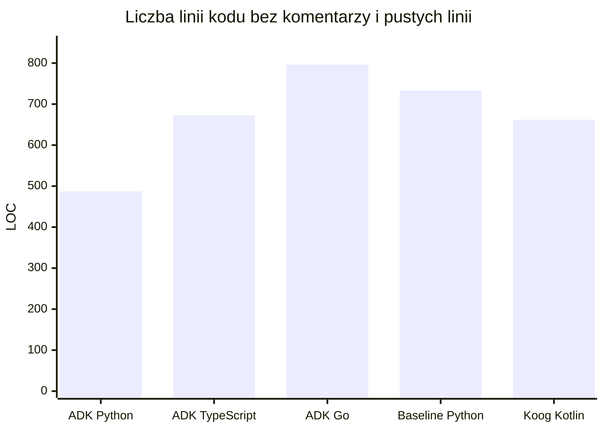

## Benchmark frameworków agentowych dla agenta do faktury VAT

Benchmark porównuje pięć implementacji tego samego zadania: zbieranie danych do faktury VAT w dialogu z użytkownikiem, walidację danych, przeliczenie pozycji i zwrot finalnego JSON-a. W praktyce decydujące okazały się trzy rzeczy: kompletność końcowego JSON-a, poprawność walidacji schematu oraz stabilność orkiestracji narzędzi.

## Cel projektu

Porównanie dwóch rodzin frameworków agentowych pod kątem jakości, wydajności i developer experience:
- Google ADK w Pythonie, TypeScript i Go
- JetBrains Koog w Kotlinie
- Baseline w Pythonie jako punkt odniesienia
Zadanie benchmarkowe polegało na zbudowaniu agenta konwersacyjnego, który zbiera dane do wystawienia faktury VAT i na końcu zwraca kompletny JSON w ustalonym formacie.

## Scenariusz testowy
Każdą implementację uruchomiono na tym samym scenariuszu rozmowy:

> Chcę wystawić fakturę. Sprzedawca to Aperture Solutions sp. z o.o., NIP 5271234567, ul. Marszałkowska 10/4, 00-001 Warszawa. Faktura dla Jana Kowalskiego, NIP 8431234560, ul. Długa 3/4, 30-200 Kraków. Dwie pozycje: konsultacje IT — 40 godzin po 150 zł netto, VAT 23%, oraz licencja oprogramowania — 1 sztuka, 2500 zł netto, VAT 23%. Płatność przelewem na konto 12 3456 7890 1234 5678 9012 3456, termin 14 dni.

W scenariuszu celowo brakowało części danych, aby sprawdzić, czy agent potrafi dopytać o brakujące elementy, utrzymać naturalną rozmowę i doprowadzić do poprawnego finalnego JSON-a.

## Metodologia

- W tabeli konfiguracji pokazano najlepszy run dla każdej pary framework/model.
- Agregacje frameworków liczone są ze wszystkich lokalnych runów danego frameworka.
- Walidacja JSON-a obejmowała obecność wymaganych sekcji, poprawność pozycji faktury oraz zgodność sum netto, VAT i brutto.
- Jako trzeci model wybrano `qwen3.5:9b`, bo jest praktycznym lokalnym modelem open-source do testów tool-calling i dobrze pokazuje zachowanie frameworka bez wpływu usług chmurowych.

## Tabela zbiorcza konfiguracji

| Framework       | Model       | Status           | Runy | TTFR [s] | Czas całk. [s] | Rundy LLM | Tokeny [sum] | Ocena 0-5 | JSON OK | Schema OK |
| --------------- | ----------- | ---------------- | ---: | -------: | -------------: | --------: | -----------: | --------: | ------: | --------: |
| adk-python      | gemma4:e4b  | NO_FINAL_INVOICE |    1 | 1105.954 |       1590.748 |         4 |        12260 |      1.00 |       0 |         0 |
| adk-python      | gpt-oss:20b | OK               |    4 |   76.565 |        265.347 |         4 |        12094 |      5.00 |       1 |         1 |
| adk-python      | qwen3.5:9b  | NO_FINAL_INVOICE |    1 |   62.483 |        248.390 |         4 |        14278 |      1.00 |       0 |         0 |
| adk-typescript  | gemma4:e4b  | NO_FINAL_INVOICE |    3 |   33.400 |        122.740 |         4 |            0 |      1.00 |       0 |         0 |
| adk-typescript  | gpt-oss:20b | OK               |    1 |    1.478 |        228.670 |         4 |            0 |      5.00 |       1 |         1 |
| adk-typescript  | qwen3.5:9b  | SCHEMA_FAIL      |    2 |   37.893 |        320.079 |         4 |            0 |      1.00 |       1 |         0 |
| adk-go          | gemma4:e4b  | NO_FINAL_INVOICE |    3 |   31.671 |        158.785 |         4 |        11403 |      0.00 |       0 |         0 |
| adk-go          | gpt-oss:20b | NO_FINAL_INVOICE |    3 |   84.282 |        396.743 |         4 |        12506 |      0.00 |       0 |         0 |
| adk-go          | qwen3.5:9b  | NO_FINAL_INVOICE |    2 |   30.552 |        175.559 |         4 |        14207 |      0.00 |       0 |         0 |
| baseline-python | gemma4:e4b  | OK               |    1 |   27.853 |        158.603 |        10 |        33572 |      1.00 |       1 |         1 |
| baseline-python | gpt-oss:20b | OK               |    1 |   37.109 |        440.880 |        14 |        40159 |      5.00 |       1 |         1 |
| baseline-python | qwen3.5:9b  | OK               |    2 |   40.363 |        431.574 |        11 |        43291 |      1.00 |       1 |         1 |
| koog-kotlin     | gemma4:e4b  | NO_FINAL_INVOICE |    1 |    0.000 |        276.491 |         1 |            0 |      1.00 |       0 |         0 |
| koog-kotlin     | gpt-oss:20b | NO_FINAL_INVOICE |    1 |    0.000 |        747.935 |         1 |            0 |      3.00 |       0 |         0 |
| koog-kotlin     | qwen3.5:9b  | NO_FINAL_INVOICE |    1 |    0.000 |        786.203 |         1 |            0 |      1.00 |       0 |         0 |

Uwagi do tabeli:
- `JSON OK = 1` oznacza, że agent zwrócił obiekt `final_invoice_json`.
- `Schema OK = 1` oznacza, że JSON przeszedł walidację struktury i rachunkową kontrolę pozycji oraz sum.

## Agregacja frameworków

| Framework       | Uruchomienia | Średnia ocena | Średni TTFR [s] | Średni czas [s] | Tokeny input | Tokeny output | Tokeny total | Średni RAM [MB] | Final invoice rate [%] | Schema pass rate [%] | Hallucinated tools rate [%] |
| --------------- | -----------: | ------------: | --------------: | --------------: | -----------: | ------------: | -----------: | --------------: | ---------------------: | -------------------: | --------------------------: |
| adk-python      |            6 |          2.33 |         238.525 |         490.416 |        55829 |          8880 |        64709 |           246.8 |                   33.3 |                 33.3 |                        33.3 |
| adk-typescript  |            6 |          1.67 |          30.893 |         230.535 |            0 |             0 |            0 |           161.2 |                   33.3 |                 16.7 |                         0.0 |
| adk-go          |            8 |          0.00 |          32.032 |         392.623 |        85007 |         27947 |       112954 |             2.0 |                    0.0 |                  0.0 |                         0.0 |
| baseline-python |            4 |          2.00 |          35.534 |         442.542 |       158253 |         28719 |       186972 |            62.5 |                  100.0 |                 75.0 |                         0.0 |
| koog-kotlin     |            3 |          1.67 |           0.000 |         603.543 |            0 |             0 |            0 |            41.3 |                    0.0 |                  0.0 |                         0.0 |

`koog-kotlin` nie raportował poprawnie zużycia tokenów przy wykorzystaniu wysokopoziomowej klasy AiAgent. Pomiar był natomiast prosty przy bezpośredniej pracy z „raw” LLM-em, ale wymagało to ręcznej implementacji pętli agenta, obsługi narzędzi i całej orkiestracji rozmowy.

`adk-typescript` wystąpił niezidentyfikowany problem z liczeniem tokenów 
 
## Wykres porównawczy
  
### LOC w implementacjach

  
## Ranking frameworków

Ranking poniżej uwzględnia najpierw kompletność i poprawność faktury, potem stabilność działania, a dopiero na końcu szybkość.

1. `baseline-python` - jedyny framework, który dostarczył poprawny final JSON dla wszystkich trzech modeli; najlepszy wybór do wdrożenia produkcyjnego mimo większego kosztu czasowego i tokenowego.
2. `adk-python` - najlepszy kandydat z rodziny ADK pod względem jakościowym, ale niestabilny; jeden model przeszedł, dwa nie domknęły scenariusza.
3. `adk-typescript` - bardzo szybki i lekki w pierwszym kontakcie, ale zbyt nierówny: tylko jeden w pełni poprawny wynik, jeden wynik częściowy i brak spójnej telemetrii tokenów.
4. `adk-go` - bardzo oszczędny pamięciowo i technicznie minimalistyczny, ale w benchmarku nie był w stanie poprawnie domknąć scenariusza faktury dla żadnego modelu. Framework wymaga dużej precyzji w orkiestracji narzędzi i ręcznego pilnowania przepływu rozmowy, przez co koszt implementacyjny szybko rośnie mimo dobrych parametrów runtime.
5. `koog-kotlin` - najbardziej eksperymentalny z testowanych frameworków. Dużą zaletą jest prostota dodawania własnych narzędzi oraz możliwość budowania bardziej zaawansowanego planowania przebiegu rozmowy, np. w oparciu o grafy stanów i planner workflow. Jednocześnie dokumentacja okazała się trudna dla osób bez wcześniejszego doświadczenia z agentami AI, a część przykładów i API była nieaktualna względem najnowszej wersji Koog, co utrudniało implementację i debugging.

  
## Co nas zaskoczyło

-  Wiele razy modle z których korzystaliśmy wszczególności gemma4 próbowała korzystać z narzędzi które nie istniały.
- `adk-typescript` osiągnął najlepszy pojedynczy TTFR, ale jednocześnie nie raportował tokenów w logach, co utrudnia pełną ocenę kosztu rozmowy.
- `baseline-python` nie był najszybszy, ale jako jedyny zachował pełną konsekwencję końcowego JSON-a we wszystkich modelach.
- `adk-go` miał bardzo niski peak RAM, jednak w praktyce nie przełożyło się to na ukończenie zadania.
- `koog-kotlin` generował minimalną liczbę rund, co wyglądało na zaletę tylko na papierze; w rzeczywistości był to objaw zbyt wczesnego zakończenia orkiestracji.
- Model `qwen3.5:9b` okazał się dobrym testem stabilności tool-calling, bo wyraźnie różnicował implementacje lepiej niż sam `gpt-oss:20b`.

## Porównanie wygenerowanych faktur

Poniższe zestawienie odpowiada na pytanie, czy finalny JSON był jednocześnie obecny i poprawny.

| Framework       | 3/3 poprawne i kompletne | Częściowy JSON | Brak final invoice | Wniosek                                                      |
| --------------- | -----------------------: | -------------: | -----------------: | ------------------------------------------------------------ |
| adk-python      |                        1 |              0 |                  2 | Działa tylko w części przypadków, ale gdy działa, to dobrze. |
| adk-typescript  |                        1 |              1 |                  1 | Najszybszy, ale zbyt niestabilny, aby uznać go za gotowy.    |
| adk-go          |                        0 |              0 |                  3 | Nie domyka scenariusza faktury.                              |
| baseline-python |                        3 |              0 |                  0 | Jedyny kompletne i powtarzalne rozwiązanie.                  |
| koog-kotlin     |                        0 |              3 |                  0 | Nie domyka scenariusza w obecnym stanie.                     |
  
## Developer Experience

Metryki ilościowe DX z logów są ograniczone do LOC i rozmiaru repozytorium z zależnościami, dlatego tę część należy czytać razem z obserwacją jakości finalnych wyników.

| Framework       | LOC | Rozmiar projektu [MB] | Ocena dokumentacji frameworka [1-5] | Czytelność błędów [1-5] | Łatwość podpięcia innego modelu [1-5] | Komentarz                                                                                                                                                                   |
| --------------- | --: | --------------------: | ----------------------------------: | ----------------------: | ------------------------------------: | --------------------------------------------------------------------------------------------------------------------------------------------------------------------------- |
| adk-python      | 487 |                 54.35 |                                   4 |                       3 |                                     5 | Najbardziej naturalny balans między strukturą kodu a elastycznością integracji.                                                                                             |
| adk-typescript  | 673 |                320.71 |                                   3 |                       3 |                                     5 | Dobra ergonomia języka, ale duży koszt zależności i niepełna telemetria.                                                                                                    |
| adk-go          | 796 |                  0.04 |                                   3 |                       3 |                                     5 | Kod jest zwięzły, ale integracyjnie wymaga najwięcej precyzji i nie wybacza braków w orkiestracji.                                                                          |
| baseline-python | 733 |                211.84 |                                   4 |                       4 |                                     5 | Najlepsza baza do szybkiej iteracji i podmiany.                                                                                                                             |
| koog-kotlin     | 662 |                  44.5 |                                   3 |                       4 |                                     4 | Dobra integracja z ekosystemem JVM i czytelne błędy, ale framework wymaga większego narzutu konfiguracji oraz bardziej złożonej orkiestracji niż konkurencyjne rozwiązania. |

# Ograniczenia benchmarku i środowiska testowego

Wyniki benchmarku należy traktować jako porównanie eksperymentalne, a nie bezpośrednią prognozę zachowania frameworków w środowisku produkcyjnym. Wszystkie testy były wykonywane lokalnie na laptopie, z użyciem modeli uruchamianych on-prem (gpt-oss:20b, gemma4:e4b, qwen3.5:9b). Oznacza to, że na wyniki wpływały również ograniczenia sprzętowe, m.in. dostępna pamięć RAM/VRAM, throttling CPU/GPU, lokalna konfiguracja runtime oraz sposób kwantyzacji modeli.

W praktyce rezultaty osiągane w środowisku produkcyjnym mogą wyglądać inaczej:

modele mogą generować stabilniejsze odpowiedzi na mocniejszym sprzęcie lub przy innym backendzie inferencyjnym,
TTFR i całkowity czas odpowiedzi mogą znacząco się zmienić przy wykorzystaniu serwerowych GPU,
część problemów z tool-callingiem mogła wynikać z ograniczeń lokalnej inferencji, a nie wyłącznie z frameworka,
niektóre frameworki mogły być bardziej wrażliwe na opóźnienia lub ograniczenia zasobów niż inne.

Benchmark miał więc przede wszystkim pokazać:

jak frameworki zachowują się w identycznym scenariuszu agentowym,
jak radzą sobie z orkiestracją narzędzi i walidacją JSON-a,
jak różne modele open-source wpływają na stabilność całego pipeline’u.

Nie należy traktować tych wyników jako absolutnego rankingu jakości frameworków w każdych warunkach produkcyjnych.

## Podsumowanie końcowe

- Najlepsza jakość końcowa: `baseline-python`
- Najniższy peak RAM: `adk-go`
  
